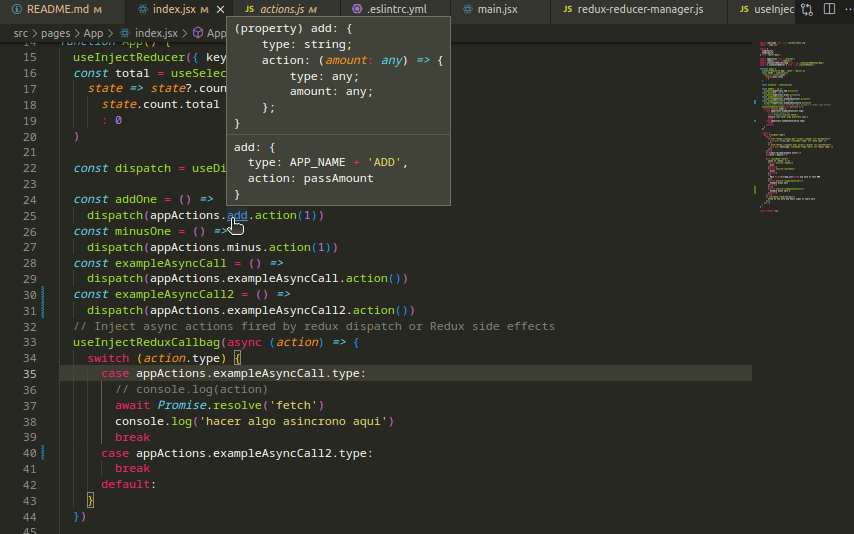

# react-redux-callbag-example
An example of the use Callbags to generate Redux side effects from a React Component.

- Introduced a new notation or way to define actions for later link between reducer and calls names.
- Callbags-based middleware for Redux.
- Code Splitting with redux-reducer-manager.
- React hooks to inject reducers and actions or Redux side effects.

Yet another intuitive Redux side effect manager.
Use of [callbags](https://github.com/callbag/callbag) to work with redux in the idea of redux-observable or redux-saga.

> You can also have a look at:
> - [redux-saga](https://redux-saga.js.org/) An intuitive Redux side effect manager.
> - [redux-observable](https://redux-observable.js.org/) RxJS-based middleware for Redux. Compose and cancel async actions to create side effects and more.

## Usage

This project uses [vitejs](https://vitejs.dev/) as the base. To install run:
```bash
# npm
npm install
npm run dev
```
```bash
# yarn
yarn
yarn dev
```

## Doc

### Part 1, New notation to define redux actions

#### Define redux actions
We can have a look to file `"/src/pages/App/actions.js"` . [Go to actions definition](src/pages/App/actions.js)

Here, we define methods to access actions types and functions at the same place.</br>
It simplifies the way we work with this elements later thanks to the IDE campabilities like [vscode #Go to Definition][vscode #Go to Definition].</br>
Also we can reuse a function for many action calls like the methods add and minus in the example.

#### Using redux actions at the reducer

We only import one var for actions. [Go to reducer definition](src/pages/App/reducer.js)

```js
import appActions from './actions';
```
Then we use it at the reducer like:
```js
switch (action.type) {
    case appActions.add.type:
    draft.total = draft.total + action.amount
    break
    case appActions.minus.type:
    draft.total = draft.total - action.amount
    break
    default:
}
```

#### Using redux actions at the react component

As the reducer definition we only need to import one var.
```js
import appActions from './actions';
```

Later we call actions or types like:

```js
const dispatch = useDispatch()

const addOne = () => dispatch(appActions.add.action(1))
```
```js
switch (action.type) {
    case appActions.exampleAsyncCall.type:
    // Async/await code, fetch info, etc
    await Promise.resolve('fetch')
    ...
    break
```

If we use [vscode](https://code.visualstudio.com/) we can see the action type and definition using `Ctrl` or go to the definition with `Ctrl + Click`. See [vscode #Go to Definition][vscode #Go to Definition]



[vscode #Go to Definition]: https://code.visualstudio.com/docs/editor/editingevolved#_go-to-definition

### Part 2, Code splitting

We use a redux-reducer-manager with the idea of [code splitting](https://redux.js.org/usage/code-splitting). link to [src/redux-reducer-manager.js](src/redux-reducer-manager.js)
Use of redux-reducer-manager:

```js
// Create a store where we can manage reducers 
import { configureStore } from './redux-reducer-manager'
//... later ...

const store = configureStore({
  initialState: {},
  initialReducers: {},
  middlewares: [
    middlewareCallbagReactive
  ],
})

// Add callbag to the store
// Used to subscribe to store with callbags from components
store.callbagSource = source
```

So we can load our reducers from react components.
For this we use a hook [src/injectReducer.js](src/injectReducer.js). </br>
Use of injectReducer hook:

```js
import { useInjectReducer } from '../../injectReducer';
import reducer from './reducer';
//... later inside the React Component ...

  useInjectReducer({ key: 'count', reducer })

```

### Part 3, Redux Callbag

The goal is to easyly call async functions from redux or Redux side effects.
For that we use reactive programing using a callbag to subscribe to.

[Why we need callbags](https://staltz.com/why-we-need-callbags.html), by André Staltz

First we add a Middleware to the redux store to pipe redux actions to a callbag.

```js
import fromFunction from 'callbag-from-function';

const {source, emitter} = fromFunction();

// ... later ...

// Middleware where we can subscribe and recibe actions dispatched to store
// function middlewareCallbagReactive({ getState }) {
const middlewareCallbagReactive = ({ getState }) => {
  return next => action => {
    // Send action to callbag
    emitter(action)
    // Call the next dispatch method in the middleware chain.
    const returnValue = next(action)

    // This will likely be the action itself, unless
    // a middleware further in chain changed it.
    return returnValue
  }
}

const store = configureStore({
  initialState: {},
  initialReducers: {},
  middlewares: [
    middlewareCallbagReactive    
  ],
})

// Add callbag to the store
// Used to subscribe to store with callbags from components
store.callbagSource = source
```

Second we inject it to our React Component using a hook [src/useInjectReduxCallbag.js](src/useInjectReduxCallbag.js). </br>

```js
import useInjectReduxCallbag from '../../useInjectReduxCallbag';
//... later inside the React Component ...

    // Inject async actions fired by redux dispatch or Redux side effects
  useInjectReduxCallbag(async (action) => {
    switch (action.type) {
      case appActions.exampleAsyncCall.type:
        // console.log(action)
        await Promise.resolve('fetch')
        console.log('async code here')
        break
      case appActions.exampleAsyncCall2.type:
        break
      default:  
    }
  })

```
We can move async functions to another file for a clearer code.


